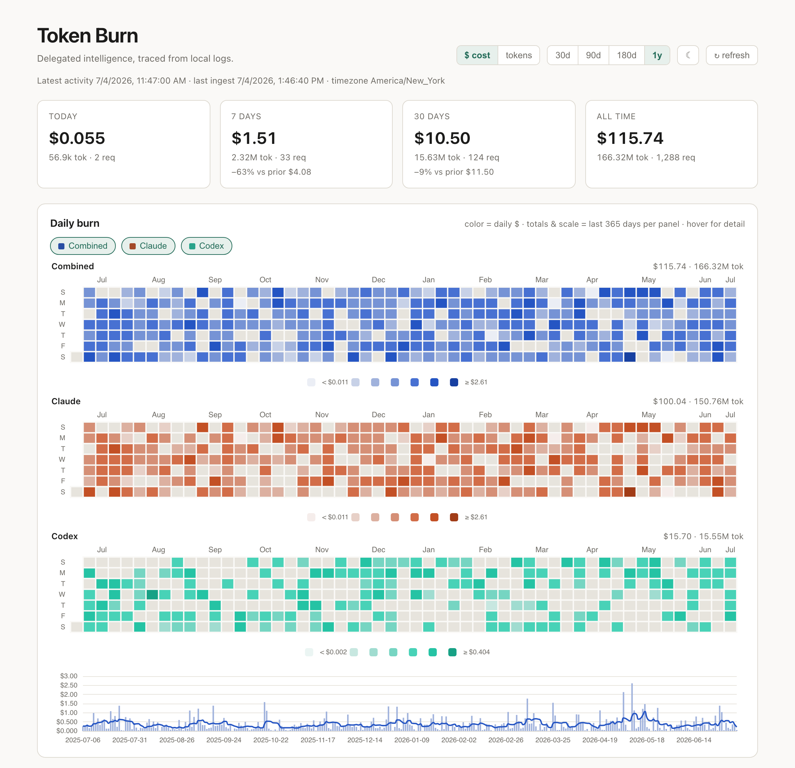
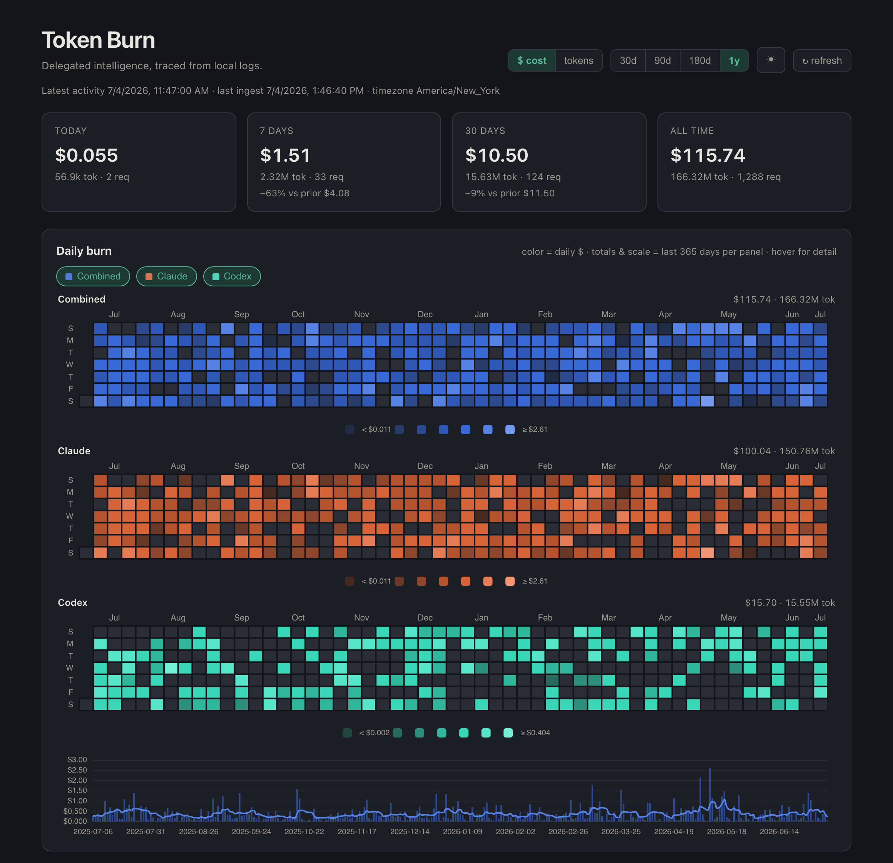

# Token Burn Dashboard

A self-hosted dashboard that turns the usage logs your AI coding tools already write
to disk into a **Tufte-style calendar heat map of daily token burn** — plus per-model,
per-project, per-session, and burn-rate views. It tracks **Claude Code** and **Codex**
out of the box (with a pluggable adapter interface for other tools), persists to a
lightweight local **DuckDB**, deploys via **docker compose**, and re-ingests
incrementally on a schedule and on every run.

The heat map renders as **per-provider panels plus a combined total** (e.g. Claude,
Codex, and Combined), and each panel can be **toggled on/off** — the selection is
remembered in your browser. Panels share a common date window and each is color-scaled
to its own range so a quiet provider's pattern stays visible next to a busy one.

The framing follows Nate B Jones's "token burn" idea: tokens are a proxy for
*delegated intelligence*, and this is a learning loop — not a leaderboard.

> **Privacy:** everything runs locally. Logs are read **read-only**; nothing is sent
> anywhere. Dollar figures are *notional* (token counts × published prices from
> `pricing.yaml`), not a bill.

## Screenshots

Rendered from synthetic demo data (no real usage), in light and dark mode:

| Light | Dark |
| --- | --- |
|  |  |

Regenerate with `uv run python scripts/screenshot.py` (one-time: `uv run playwright install chromium`).

---

## Quick start (docker compose)

```bash
cp .env.example .env          # optional — adjust TZ, interval, limits
docker compose up --build
# open http://localhost:8080
```

Compose mounts `~/.claude` and `~/.codex` **read-only** and stores the DuckDB file in
`./data`. Set the timezone so the heat map buckets by *your* day, not UTC:

```bash
TZ=America/Chicago docker compose up --build
```

## Quick start (local, no Docker)

Requires [`uv`](https://docs.astral.sh/uv/).

```bash
uv run token-dashboard serve        # ingests on boot, serves on 127.0.0.1:8080
# or run a one-off ingest:
uv run token-dashboard ingest
uv run token-dashboard reprice       # reprice stored costs if pricing.yaml changed
uv run pytest                        # Python regression tests
node --test tests/frontend.test.cjs   # frontend regressions (Node.js 18+)
```

`serve` binds to loopback by default (it reads your private usage logs); pass
`--host 0.0.0.0` to expose it on the network. The Docker entrypoint does this
inside the container. Compose publishes to `127.0.0.1` on the host by default;
set `HOST_BIND=0.0.0.0` explicitly if you want network access.

---

## What it reads

| Tool | Path (default) | Notes |
|---|---|---|
| Claude Code | `~/.claude/projects/**/*.jsonl` | ground truth; per-request token usage incl. cache tiers |
| Codex CLI | `~/.codex/sessions/**/rollout-*.jsonl` | per-turn usage; model joined from `turn_context` |

Other tools (Gemini, Cursor, Copilot, …) aren't present on most machines; adding one
is a single new file under `src/token_dashboard/ingest/` plus an entry in
`registry.py`. The canonical event shape is in `ingest/base.py`.

### Correctness notes (why the numbers are trustworthy)

- **Claude dedup:** one API turn is split across several JSONL lines that each repeat
  the *identical* usage payload. We collapse to one row per `requestId` (or stable
  message id), so totals aren't multiplied 2–10×.
- **Codex deltas:** `total_token_usage` is a running cumulative total — summing it
  squares the count. We sum the per-turn `last_token_usage` deltas instead.
- **Cache pricing:** cache reads (~0.1×) and cache writes (1.25×/2×) are billed at
  their own rates, never at the base input rate — on coding logs cache tokens
  dominate, so this is the difference between a believable burn number and one off by
  an order of magnitude.
- **Local timezone:** logs are UTC; the heat map buckets by the configured `TZ`.

---

## Configuration

Set via `.env` / environment (overrides), or an optional YAML file (`TD_CONFIG=./config.yaml`).
See `.env.example` and `config.example.yaml`.

| Variable | Default | Meaning |
|---|---|---|
| `TZ` | `America/New_York` | local day for heat-map bucketing |
| `TD_INGEST_INTERVAL_MIN` | `15` | scheduled re-ingest interval |
| `TD_DB_PATH` | `./data/token.duckdb` | DuckDB file |
| `TD_CLAUDE_ROOT` / `TD_CODEX_ROOT` | home dirs | scan roots |
| `TD_PRICING_PATH` | `./pricing.yaml` | editable rate table |
| `TD_LIMIT_5H_TOKENS` / `TD_LIMIT_WEEK_TOKENS` | unset | enable plan-utilization gauges |
| `HOST_PORT` (compose) | `8080` | host port |

### Pricing

`pricing.yaml` holds USD-per-million-token rates per provider/model, with `input`,
`cache_write_5m`, `cache_write_1h`, `cache_read`, and `output` tiers. **Re-verify
against the vendor pricing pages periodically** — model lineups change. The app
stores a content hash of `pricing.yaml`; editing the file and hitting **↻ refresh**
(or restarting) reprices existing rows once and uses the new rates for new ingests.
Use `uv run token-dashboard reprice --force` to recompute stored costs even when the
file hash has not changed.

---

## How updates happen

The server ingests once on startup (so the dashboard is current the moment you open
it) and then re-ingests every `TD_INGEST_INTERVAL_MIN` minutes via an in-process
scheduler — one process owns all DuckDB writes (its single-writer model). Ingestion
is incremental (byte-offset watermark for Claude; change-detected re-parse for Codex)
and idempotent (`ON CONFLICT` on a stable event id), so re-runs never double-count.
Truncated or replaced files restart from the beginning; existing event IDs still
deduplicate. Events and each file watermark commit together. Ingestion and
repricing share a lock, and shutdown waits for scheduled ingestion to finish.
The **↻ refresh** button triggers an immediate ingest; all panels poll every 60s.
New selections cancel older requests so delayed responses cannot overwrite the
current range or filter. Failed files appear in `/api/health` and on the dashboard;
healthy files continue ingesting, and health reports `degraded` until recovery.

## API

`GET /` · `/api/summary` · `/api/heatmap?days=&metric=&model=&project=` ·
`/api/punchcard?days=&model=&project=` · `/api/models?days=` ·
`/api/projects?days=&limit=` · `/api/sessions?days=&limit=` ·
`/api/turns?days=&limit=` · `/api/export.csv?days=&model=&project=` · `/api/burn` ·
`/api/health` · `POST /api/ingest` · `POST /api/reprice?force=`.

`days` accepts 1–3660 and limits results to the last N *local* calendar days (snapped to local
midnight, so the earliest day is never a partial total); omit it for all time
except for the heatmap, which defaults to 365 days. Table `limit` accepts 1–1000;
`metric` accepts `cost` or `tokens`. Invalid query values return HTTP 422.
The dashboard's 30d/90d/180d/1y range toggle drives this parameter for the heat
map **and** the models/projects/sessions/requests tables.

`/api/heatmap` returns `{ metric, days, combined: [...], providers: { <provider>: [...] } }`
(plus `series` as a back-compat alias for `combined`, and `start_day`/`end_day`);
series include zero-filled inactive dates and end today in the configured timezone.
The trend uses seven calendar days, leaving its first six averages blank until
there is a complete window. Each daily entry carries
`cost`, `tokens`, and the `input`/`output`/`cache_read`/`cache_creation` breakdown.
`/api/models` also returns `cache_savings` (notional $ saved by prompt caching over
the same window), and `/api/summary` and `/api/health` list `unpriced_models` —
models with usage whose resolved rate is all-zero, i.e. silently undercounting.

`model=`/`project=` scope the heat map, the punchcard, and the CSV export to one
model or project directory — in the UI, click a row in the **Models** or
**Projects** table to apply the filter (click again, or the ✕ chip, to clear).
`/api/punchcard` returns local weekday × hour totals (`dow` 0=Sunday), rendered as
the **Rhythm** card — *when* the burn happens. `/api/export.csv` streams the raw
usage events (one row per request, all token classes + cost) for downstream
analysis, fetched and serialized in batches from one query snapshot; the
**⬇ csv** button downloads the current range and filter.

---

## Offline use

The frontend loads ECharts from a CDN. For a fully offline deploy, download
`echarts.min.js` into `src/token_dashboard/static/` and point the `<script>` in
`templates/base.html` at `/static/echarts.min.js`.

## Layout

```
src/token_dashboard/
  config.py  db.py  pricing.py  metrics.py  scheduler.py  main.py  cli.py
  ingest/{base,registry,claude,codex}.py
  templates/{base,dashboard}.html   static/{app.js,styles.css}
pricing.yaml  docker-compose.yml  Dockerfile  entrypoint.sh  tests/
```

## License

[MIT](LICENSE) © 2026 Michael J. Stealey
